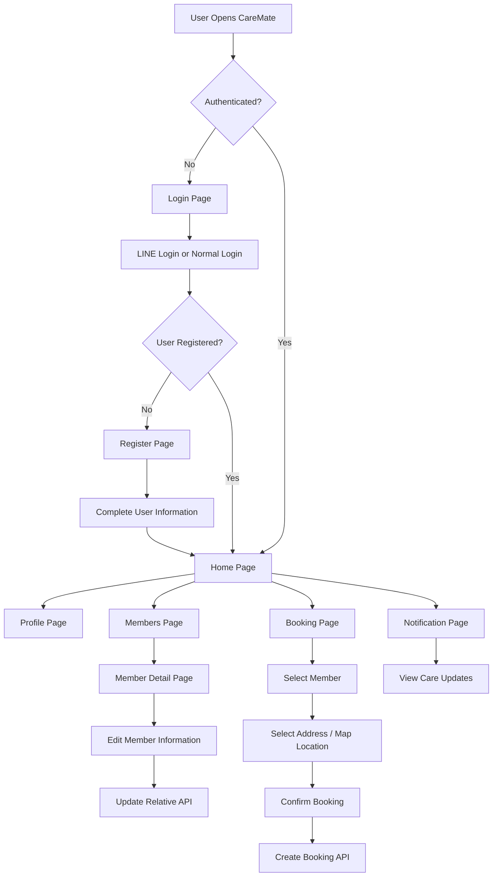
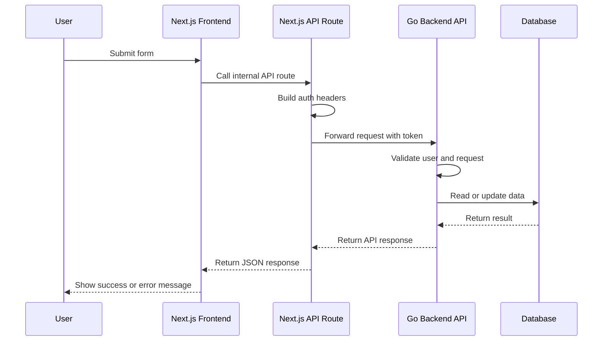

# CareMate Frontend

CareMate is a digital care companion web application designed to help families manage caregiving information, member profiles, relatives, addresses, bookings, and care-related notifications in one place.

This project is built with **Next.js App Router** and focuses on providing a clean, mobile-friendly, and user-friendly experience for users who need to manage care services for themselves or their family members.

---

## About CareMate

CareMate is an application for managing care-related activities such as:

* User registration and login
* Member profile management
* Relative and family member management
* Address and location selection
* Care service booking
* Booking status tracking
* Notification center
* Multi-language support
* LINE Login integration
* Secure frontend-to-backend API communication

The goal of the application is to make caregiving easier, more organized, and more accessible for users and families.

---

## Main Features

### Authentication

Users can log in through the authentication flow connected to the backend service. The application supports protected pages and uses secure API routes for authenticated requests.

Main authentication-related features include:

* Login page
* Register page
* Protected routes
* Fetch current user profile
* Session-based user access
* LINE Login support

---

### User Profile

Users can view and manage their personal profile information.

Profile information may include:

* First name
* Last name
* Phone number
* Email
* Gender
* Date of birth
* Address
* Emergency contact
* Health-related notes

---

### Member and Relative Management

Users can manage relatives or family members who may need care services.

Supported member information includes:

* Relationship
* First name and last name
* Nickname
* Gender
* Date of birth
* Phone number
* Email
* Address information
* Latitude and longitude
* Emergency contact information
* Blood type
* Allergies
* Congenital diseases
* Current medications
* Care note

Users can view, edit, and update member information through the member detail page.

---

### Address and Map Picker

The application supports map-based location selection for address management.

Map-related features include:

* Interactive map picker
* Marker selection
* Latitude and longitude storage
* Default Bangkok location
* Address form integration

The map feature uses Leaflet and React Leaflet.

---

### Booking Flow

CareMate is designed to support a care service booking flow.

The basic booking flow is:

1. User logs in
2. User selects or manages a member
3. User enters required care information
4. User selects address or location
5. User chooses service details
6. User confirms booking
7. Booking data is sent to the backend
8. User receives booking status updates

---

### Notification Center

The application includes a notification page for displaying care-related updates.

Example notification types include:

* Booking confirmation
* Medicine reminders
* Payment updates
* Care note updates
* Security alerts
* System notifications

Currently, the notification page can be used with mock data and later connected to a real notification API.

---

### Multi-language Support

CareMate supports language switching through the internal i18n provider.

The UI can display translated text such as:

* App name
* Common labels
* Buttons
* Form labels
* Page messages

---

## Application Flow



---

## Frontend to Backend Flow



---

## Example API Flow: Update Relative

When a user updates member information, the frontend sends a PATCH request to the internal Next.js API route.

Frontend request:

```ts
PATCH /api/relative/:relativeId
```

The Next.js API route forwards the request to the backend:

```ts
PATCH /api/v1/user-relatives/:relativeId
```

The backend then validates the user, checks that the relative belongs to the current user, updates the data, and returns the latest relative information.

---

## Tech Stack

### Frontend

* Next.js
* React
* TypeScript
* Tailwind CSS
* Next.js App Router
* Client Components
* Server-side API routes
* Dynamic imports for browser-only libraries

### Map

* Leaflet
* React Leaflet

### Authentication

* LINE Login
* Cookie-based authentication
* Protected frontend pages
* Authenticated backend API requests

### State and UI

* React hooks
* Custom components
* Form state management
* Popup components
* Language switcher
* Responsive mobile-first layout

### Backend Integration

* Go backend API
* REST API
* JSON request and response format
* Authenticated API proxy through Next.js route handlers

### Development Tools

* Node.js
* npm / yarn / pnpm / bun
* TypeScript
* ESLint
* Git
* VS Code

---

## Project Structure

Example project structure:

```txt
src/
├── app/
│   ├── api/
│   │   └── relative/
│   │       └── [relativeId]/
│   │           └── route.ts
│   ├── (protected)/
│   │   ├── members/
│   │   │   └── [relativeId]/
│   │   │       └── page.tsx
│   │   ├── profile/
│   │   │   └── addresses/
│   │   │       └── map-picker.tsx
│   │   └── notifications/
│   │       └── page.tsx
│   └── page.tsx
│
├── components/
│   ├── input/
│   ├── card/
│   └── language-switcher.tsx
│
├── dto/
│   └── register.ts
│
├── libs/
│   ├── i18n/
│   └── user/
│
└── styles/
```

---

## Getting Started

Install dependencies:

```bash
npm install
```

Run the development server:

```bash
npm run dev
```

Or use another package manager:

```bash
yarn dev
```

```bash
pnpm dev
```

```bash
bun dev
```

Open the application in your browser:

```txt
http://localhost:3000
```

---

## Environment Variables

Create a `.env.local` file in the project root.

Example:

```env
NEXT_PUBLIC_APP_NAME=CareMate
NEXT_PUBLIC_BACKEND_URL=http://localhost:8080/api/v1
```

The actual environment variables may depend on the backend configuration and authentication flow.

---

## Available Scripts

Run development server:

```bash
npm run dev
```

Build production version:

```bash
npm run build
```

Start production server:

```bash
npm run start
```

Run lint:

```bash
npm run lint
```

---

## Development Notes

### Leaflet and Next.js

Leaflet depends on the browser `window` object, so map components should be loaded using dynamic import with SSR disabled.

Example:

```ts
const MapPicker = dynamic(() => import("./map-picker"), {
  ssr: false,
});
```

This prevents the error:

```txt
ReferenceError: window is not defined
```

---

### API Route Pattern

The frontend uses Next.js API routes as a secure proxy between the browser and backend API.

Example flow:

```txt
Browser -> Next.js API Route -> Go Backend API -> Database
```

This pattern helps centralize authentication headers and backend URL management.

---

### Protected Pages

Protected pages are placed under the protected route group.

Example:

```txt
src/app/(protected)/
```

These pages are intended for authenticated users only.

---

## Main Pages

### Home Page

Main landing page after login.

### Register Page

User registration page for collecting required profile information.

### Profile Page

Displays and manages the current user's personal information.

### Member Detail Page

Displays and updates relative or care member information.

### Address Page

Allows users to manage addresses and select map location.

### Notification Page

Displays care-related notifications and system updates.

---

## Future Improvements

Planned improvements may include:

* Real notification API integration
* Booking history page
* Payment status tracking
* Caregiver matching flow
* File upload for user documents
* Push notification support
* More advanced role-based access
* Admin dashboard
* Caregiver dashboard
* Better validation and error handling
* Production deployment pipeline

---

## Deployment

The application can be deployed on platforms that support Next.js, such as:

* Vercel
* Docker server
* VPS
* Cloud server
* Kubernetes-based infrastructure

For production deployment, make sure to configure:

* Backend API URL
* Authentication settings
* Cookie domain
* HTTPS
* Environment variables
* CORS configuration on backend
* Secure headers

---

## License

This project is currently developed as part of the CareMate application.

---

## Author

CareMate Development Team
